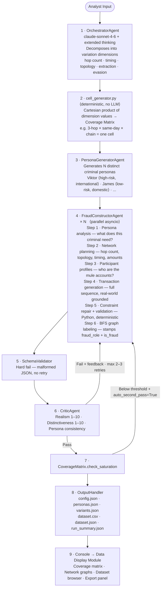
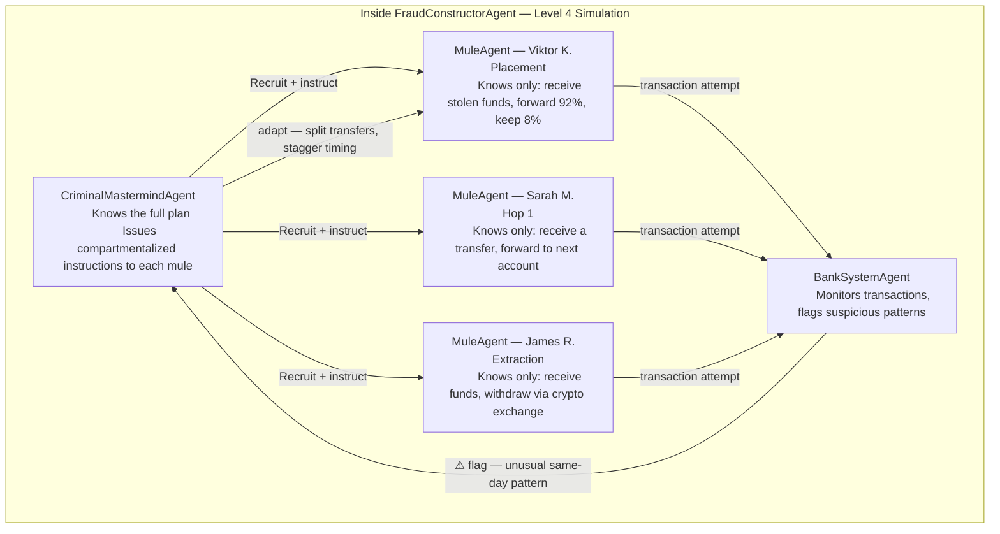
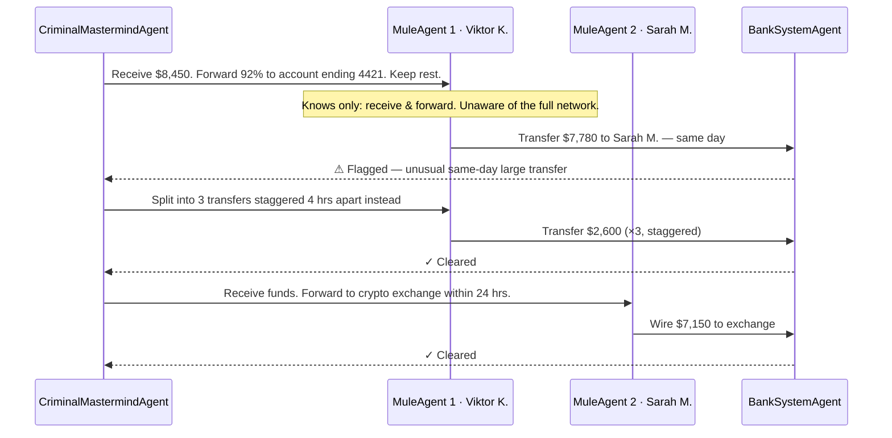
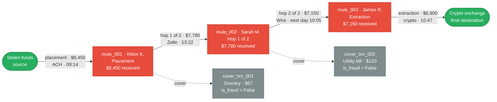
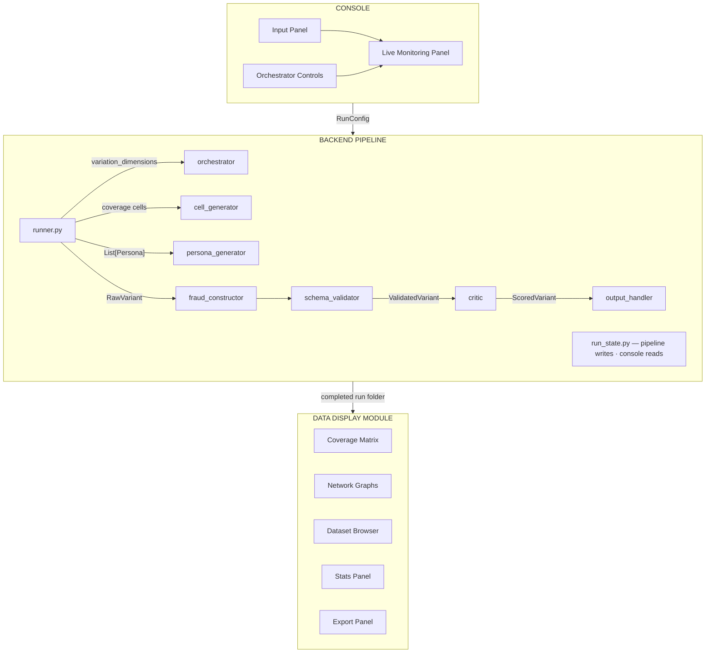
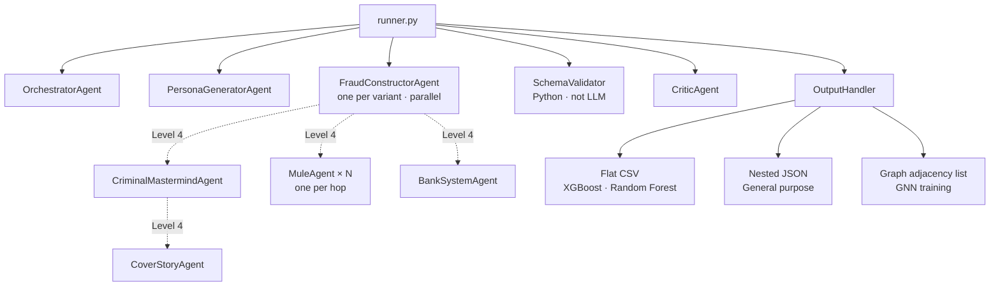

> [!NOTE]
> **DRAFT** — This project is a hackathon prototype in active development. Interfaces and output formats are subject to change.

# FraudGen [DRAFT]

**Synthetic fraud variant generation via adversarial AI agents — closing the known-unknown gap in ML-based fraud detection.**

FraudGen deploys a Red Team of AI agents that proactively explores fraud variant space ahead of real attackers, producing labeled synthetic training data for a financial institution's existing ML fraud detection pipeline.

---

## Table of Contents

1. [The Problem](#1-the-problem)
2. [The Solution](#2-the-solution)
3. [Quickstart](#3-quickstart)
4. [How It Works](#4-how-it-works)
5. [Technical Architecture](#5-technical-architecture)
6. [Fidelity Levels](#6-fidelity-levels)
7. [Time & Cost](#7-time--cost)
8. [Console Features](#8-console-features)
9. [User Guide](#9-user-guide)
10. [Output Reference](#10-output-reference)
11. [Project Status & Roadmap](#11-project-status--roadmap)
12. [Safety & Ethics](#12-safety--ethics)

---

## 1. The Problem

### Fraud ML models fail on novel variants

Banks and financial institutions defend against fraud using machine learning models trained on historical transaction data. These models are effective against fraud patterns they have seen before. The fundamental assumption is: *if it happened before, we can detect it again*.

This assumption breaks down at the edges.

### The data scarcity problem

Fraud is rare by design — typically less than 0.1% of transactions. New or emerging fraud variants are rarer still. A fraud type that surfaced six months ago might have generated only dozens of confirmed labeled examples at a given institution. No ML model can generalize from dozens of examples.

The standard response is to wait — accumulate more data, retrain, redeploy. In the meantime, the fraud continues undetected.

### The information asymmetry problem

Fraudsters have a structural advantage: they know exactly what they are targeting. They have studied the institution's controls, tested the edges, and adapted their methods before the institution even knows an attack is happening.

Institutions defend against patterns they have already seen. Every new fraud variant starts with a detection gap — a window where the model has no signal.

### The known-unknown gap

Fraud problems exist on a spectrum:

| Tier | What it means | ML status |
|---|---|---|
| Known known | We know the fraud type and have abundant examples | Well-solved |
| **Known unknown** | We know the fraud type exists but lack enough variant data | **Active gap — this is where FraudGen operates** |
| Unknown unknown | Entirely novel fraud methods not yet conceived | Research problem |

The known-unknown tier is where institutions are most exposed. They know mule networks exist — but each criminal organization structures them differently. The model learned the three cases it has seen. The fourth one gets through.

### Data requirements vs. what institutions actually have

| Model type | Minimum viable (new fraud variant) | Typical bank has | Gap |
|---|---|---|---|
| XGBoost / Random Forest | ~1,000 fraud rows | 200–500 | 2–5× |
| Graph Neural Network | ~1,000–5,000 fraud graphs | 30–50 | **20–100×** |
| Sequence Model (LSTM) | ~500–2,000 fraud sequences | 30–50 | 10–40× |

GNNs face the largest gap for network fraud types — which is why mule networks are the primary demonstration case for FraudGen.

---

## 2. The Solution

### Stop patching, start out-iterating

The conventional fraud defense posture is reactive: a fraud pattern is detected, controls are updated, the model is retrained. This is a patching loop — and it will always lag behind the attacker.

The right question is: *who can explore the attack surface faster?*

Fraudsters are fast because they are motivated and specialized. But they are fundamentally limited — individuals or small organizations with finite time and resources. A financial institution, by contrast, has compute at scale. The institution can run thousands of parallel simulations that a human fraudster could never attempt.

FraudGen converts that compute advantage into a detection advantage by deploying it on the attacker's side of the problem, **before the attacker gets there**.

### The Red Team / Blue Team model

- **Red Team** — AI agents that think like fraudsters: probe, vary tactics, find the cases that would slip through existing controls. The red team generates fraud variants and stress-tests the edges of what detection models can catch.
- **Blue Team** — The institution's existing fraud detection infrastructure. The red team feeds it. No replacement needed — the output plugs directly into existing ML training pipelines.

The red team runs *continuously and proactively* — not in response to an attack that has already happened, but ahead of it. By the time a new fraud variant reaches real customers, the institution's model has already seen a version of it.

### Why agents — not statistical synthesis

Existing synthetic data tools (like IBM's AMLSim) mirror existing data statistically. They generate more examples that look like what the institution already has.

| | IBM AMLSim | FraudGen |
|---|---|---|
| Generation method | Statistical simulation from known distributions | Adversarial LLM agents reasoning from first principles |
| Variant diversity | Statistical variation around parameterized distributions | Reasoning-based exploration of novel execution strategies |
| Evasion logic | None — mirrors known patterns | Explicit — agents reason about what controls to evade and why |
| New variant coverage | Limited to statistical model parameters | Can explore structurally novel variants within a known fraud class |
| Persona-driven behavior | No | Yes — different criminal profiles produce structurally different outputs |

Statistical simulation generates more examples of what you already know. Adversarial agents reason about what you do not know yet.

---

## 3. Quickstart

### Prerequisites

- Python 3.10+
- An Anthropic API key (for real runs) — or use mock mode (no key needed)

### Setup

```bash
# Clone and enter the repo
git clone <this-repo-url>
cd GenAi

# Create a virtual environment
python -m venv .venv
source .venv/bin/activate      # Windows: .venv\Scripts\activate

# Install dependencies
pip install -r requirements.txt

# Configure your API key
cp .env.example .env
# Edit .env and set: ANTHROPIC_API_KEY=sk-ant-...
```

### Run

```bash
# Real mode (uses API credits)
streamlit run app.py

# Mock mode (no API key consumed, instant — good for UI dev/testing)
# In .env, uncomment: FRAUDGEN_MOCK=1
streamlit run app.py
```

App opens at `http://localhost:8501`. Demo mode: `http://localhost:8501?demo=true`

---

## 4. How It Works

A fraud analyst enters a natural language fraud description. The system decomposes it, generates a diverse set of criminal personas, and deploys a parallel fleet of AI agents — each exploring a distinct corner of the fraud variant space.



### Inside the simulation — how agents model a fraud network

Each FraudConstructorAgent spins up a miniature multi-agent simulation. The Criminal Mastermind knows the full plan but gives each mule only the information a real mule would have. The Bank System Agent actively tries to flag suspicious transactions — forcing the Mastermind to adapt in real time.



The emergent evasion — the Mastermind splitting a flagged transfer, a mule adding an unplanned delay — is behaviour no single agent would produce alone. It mirrors the actual information structure of real fraud organisations.

**How the evasion plays out step by step:**



### Example output — a generated fraud network

This is what a single approved variant looks like as a transaction network. Red nodes are fraud accounts, grey nodes are cover transactions, green are external endpoints.



Each node and edge maps directly to rows in `dataset.csv` — the fraud path rows have `is_fraud = True` and `fraud_role` set to `placement`, `hop_N_of_M`, or `extraction`. Cover activity rows have `is_fraud = False`.

---

## 5. Technical Architecture

### System components

The system has three layers. The backend pipeline does all the real work; the console and data display are thin layers on top.



### Agent hierarchy



**Key design rule:** Agents never call other agents. `runner.py` is always the intermediary — it calls agent A, takes the output, and passes it to agent B. Agents only import from `models/` and `utils/`.

### Model selection

| Agent | Model | Reason |
|---|---|---|
| Orchestrator | `claude-sonnet-4-6` + extended thinking (5,000 tokens) | Dimension decomposition determines entire run quality |
| Persona Generator | `claude-sonnet-4-6` | Creative generation, moderate complexity |
| Fraud Constructor | `claude-sonnet-4-6` | Core generation agent — 4 sequential LLM calls per variant |
| Critic | `claude-sonnet-4-6` | Evaluation reasoning |
| Bank System Agent (Level 4) | `claude-haiku-4-5` | Rule application — fast and cheap |

### Data models (what flows between components)

```
RunConfig          → runner.py            (all settings for the run)
OrchestratorOutput → runner.py            (dimensions + cells + persona count)
List[Persona]      → fraud_constructor    (behavioral seed per variant)
RawVariant         → schema_validator     (unvalidated JSON from LLM)
ValidatedVariant   → critic              (schema confirmed, ready to score)
ScoredVariant      → approved_variants[] → output_handler
OutputRecord       → dataset.csv         (one row per transaction, flat)
VariantSummary     → run_state           (lightweight, for live console display)
RunState           → monitoring_panel    (pipeline writes, console reads every 1s)
```

### Quality pipeline

**Deterministic checks (Python, no LLM cost):**
- `variant_validator.py` — 8-rule constraint checker (valid channels per rail, amount floors/caps, timestamp ordering, etc.). Violations trigger `_repair_constraint_violations()` auto-fix; unfixable violations → retry without LLM cost.
- `label_transactions.py` — BFS graph traversal over the transaction graph. Stamps `fraud_role` (`placement`, `hop_N_of_M`, `extraction`, `cover_activity`) and `is_fraud` on every transaction. Labeling is guaranteed correct structurally, not scored.
- `_check_persona_consistency()` — checks that generated behavior matches the persona's stated risk tolerance, resources, and constraints. A low-resource persona generating a 9-hop international crypto network fails immediately.

**LLM-based scoring (CriticAgent):**

| Dimension | Type | Default threshold |
|---|---|---|
| Realism | Score 1–10 | ≥ 7 (configurable) |
| Variant distinctiveness | Score 1–10 | ≥ 6 (configurable) |
| Persona consistency | Boolean (deterministic) | Must be True |

Variants below threshold receive specific feedback and are returned to the FraudConstructor for revision. Maximum 2–3 revision iterations before the cell is discarded and reassigned to a fresh agent.

After the full batch, `CoverageMatrix.check_saturation()` detects clustering. If coverage is below threshold and `auto_second_pass=True`, a targeted second pass runs explicitly against underrepresented cells with stronger persona seeds.

### Concurrency model

```
Main thread:       Streamlit UI (polls RunState, re-renders via st.rerun() every 1s)
Background thread: runner.py
Async tasks:       agent calls (up to max_parallel simultaneous Claude API calls)
```

Revision loops run within the same async task — a failed variant retries without blocking parallel agents. `run_state.control_signal` is checked between batches for pause/resume/stop.

### Grounding data (static, no external APIs)

All real-world grounding is bundled as static JSON. No external API calls, no demo risk.

| File | Contents |
|---|---|
| `data/mcc_stats.json` | Amount distributions by merchant category (mean, std, range) |
| `data/payment_rail_constraints.json` | Processing windows, per-transaction limits (ACH, Interac, SWIFT, Zelle) |
| `data/account_balance_distributions.json` | Balance ranges by demographic and account type |
| `data/regulatory_thresholds.json` | Reporting thresholds by jurisdiction (US $10K CTR, CA $10K LCTR, etc.) |

### Folder structure

```
app.py                              ← Streamlit entry point
.env                                ← ANTHROPIC_API_KEY + optional FRAUDGEN_MOCK=1

models/                             ← Pydantic data models
  run_config.py                     ← All settings for one run
  persona.py                        ← Criminal profile
  variant.py                        ← Transaction, RawVariant, ValidatedVariant, ScoredVariant
  output_record.py                  ← Flat row for final CSV/dataset

agents/                             ← LLM-powered agents
  orchestrator.py
  persona_generator.py
  fraud_constructor.py
  critic.py
  level4/                           ← Next level — builds after MVP
    criminal_agent.py
    mule_agent.py
    bank_agent.py
    cover_story_agent.py

pipeline/                           ← Pure Python, no LLM calls (except through agents/)
  runner.py                         ← Async coordinator
  run_state.py                      ← Thread-safe shared state
  coverage_matrix.py                ← Variant space tracker
  cell_generator.py                 ← Deterministic Cartesian product cell builder
  variant_validator.py              ← 8-rule constraint checker
  output_handler.py                 ← File writer

utils/
  llm_client.py                     ← Async Claude API wrapper (retries, cost tracking, mock)
  schema_validator.py               ← Fast sync JSON schema validation
  label_transactions.py             ← BFS graph labeler

prompts/                            ← Plain text system prompts, one per agent
  orchestrator.txt
  persona_generator.txt
  fraud_constructor.txt
  critic.txt

data/                               ← Static grounding data
  mcc_stats.json
  payment_rail_constraints.json
  account_balance_distributions.json
  regulatory_thresholds.json

console/                            ← Streamlit UI (no agent imports)
  input_panel.py
  orchestrator_controls.py
  monitoring_panel.py
  data_display/
    coverage_matrix_view.py
    network_graph_view.py
    stats_panel.py
    dataset_browser.py
    export_panel.py

output/runs/                        ← Auto-created per run, gitignored
  run_YYYYMMDD_HHMMSS/
    config.json
    personas.json
    variants.json
    dataset.csv
    dataset.json
    run_summary.json
```

---

## 6. Fidelity Levels

Controls how deeply sub-agents model fraudster behavior. Cascades through the entire agent hierarchy.

| Level | Label | What's active | Output quality | Status |
|---|---|---|---|---|
| 2 | Fast | Single-pass constructor — no persona, no chain-of-thought | Moderate — plausible but gravitates toward generic "average fraud" | Available |
| 3 | Default | Multi-step reasoning chain (4 LLM calls), persona-seeded constructor | Good — internally consistent, persona-grounded, structurally diverse | **Recommended** |
| 4 | Deep | Full role simulation — Criminal Mastermind, Mule Agents (one per hop), Cover Story Agent, Bank System Agent with tool use | Very good — emergent evasion from information asymmetry between agents | Coming soon |

**Level 3 detail — the four-step reasoning chain:**

Before generating transactions, the FraudConstructor reasons through the scenario from the persona's perspective:
1. **Persona analysis** — what does this criminal actually need? What are their constraints and fears?
2. **Network planning** — decide hop count, topology (chain vs fan-out), timing, amount logic, cover activity
3. **Participant profiles** — for each account in the network, who are they and what do they think they're doing?
4. **Transaction generation** — full sequence, grounded in real-world constraints

**Level 4 detail — information asymmetry (preview):**

Each fraud participant gets their own agent with limited information scope:
- *Criminal Mastermind* — knows the full plan, gives compartmentalized instructions to mules
- *Mule Agents* — know only what a real mule would know ("you received funds, forward most of it, keep your cut")
- *Bank System Agent* — actively tries to flag suspicious transactions; when it flags one, the Criminal Mastermind must adapt

The emergent behavior from these interactions — the mule introducing an unplanned delay, the criminal routing around a flagged transaction — is behavior no single agent would produce alone. This mirrors the actual information structure of real fraud.

**Cost and time estimates (Level 3, 5 parallel agents):**

| Variants | Estimated cost | Estimated run time |
|---|---|---|
| 20 | ~$4–6 | ~5–7 min |
| 50 | ~$10–15 | ~12–15 min |
| 100 | ~$20–30 | ~25–30 min |

---

## 7. Time & Cost

### Where time goes

A run has two phases: **setup** (orchestrator + personas, runs once) and **generation** (constructor + critic, runs per variant in parallel).

| Phase | Who runs it | Typical duration | Notes |
|---|---|---|---|
| Orchestrator | Claude Opus + extended thinking | 30–60 s | One-time upfront. Extended thinking budget = 5,000 tokens. |
| Persona generation | Claude Sonnet | 5–15 s | One-time. Scales slightly with persona count. |
| FraudConstructor (per variant) | Claude Sonnet × 4 calls | 20–40 s | Sequential within each variant; variants run in parallel up to `max_parallel`. |
| SchemaValidator (per variant) | Python (synchronous) | < 1 s | Negligible. |
| Critic (per variant) | Claude Sonnet × 1 call | 8–15 s | Runs after constructor finishes. |
| Revision loop (if triggered) | Claude Sonnet × 1–3 more calls | +20–60 s per variant | Only on critic failures. Rare at default settings. |
| Output writing | Python | 1–3 s | One-time at end. |

**Wall-clock time ≈ setup + (variants ÷ max_parallel) × time_per_variant**

At default settings (5 parallel agents, Level 3, no revisions): ~30 s per variant / 5 agents = ~6 s of wall-clock time per variant.

---

### How it scales

**Variant count** — linear. Double the variants, double the time and cost. Parallelism is the main lever to keep wall-clock time manageable as count grows.

**Parallelism (`max_parallel`)** — near-linear speedup up to the API rate limit. At 10 parallel agents you approach Anthropic's TPM (tokens per minute) ceiling — stay at ≤ 5 for safety unless you have an elevated rate limit tier.

**Fidelity level** — step-change cost multiplier:

| Fidelity | Constructor calls per variant | Approx. multiplier vs. Level 2 |
|---|---|---|
| 2 | 1 | 1× |
| 3 | 4 | ~3–4× |
| 4 | 4 + multi-agent turns per hop | ~8–12× (depends on hop count) |

**Revision loops** — the worst-case multiplier. Each revision adds a full constructor + critic cycle per variant. At the default critic floor of 7, revision rates are typically < 10%. If you see high rejection counts, lowering the critic floor is faster than waiting for retries.

---

### Quick-reference: time and cost by run size

All estimates at **Level 3, 5 parallel agents, default settings**. Add ~1 min for setup overhead.

| Variants | Wall-clock time | API cost | Output size |
|---|---|---|---|
| 10 (quick test) | ~3–4 min | ~$1–2 | ~0.2 MB |
| 20 (fast demo) | ~5–7 min | ~$4–6 | ~0.5 MB |
| 50 (standard) | ~12–15 min | ~$10–15 | ~1 MB |
| 100 (full run) | ~25–30 min | ~$20–30 | ~2 MB |
| 1,000 (production) | ~1.5–2 hr | ~$40–60 | ~20 MB |

At **10 parallel agents**: halve the wall-clock times above. At **Level 4**: multiply cost by ~8–12×.

---

### Token budget breakdown (per 20-variant run at Level 3)

| Agent | Calls | Avg input tokens | Avg output tokens | Subtotal |
|---|---|---|---|---|
| Orchestrator (+ thinking) | 1 | 2,000 | 4,000 + 5,000 thinking | ~11K |
| Persona Generator | 1 | 1,000 | 2,000 | ~3K |
| Fraud Constructors | ~25 | 3,500 | 7,000 | ~262K |
| Critic | ~25 | 6,000 | 800 | ~170K |
| **Total** | | | | **~446K tokens** |

At Sonnet pricing (~$3 input / $15 output per million tokens): ~$4–6 for 20 variants.

---

### How to make it faster

| Want to... | Do this |
|---|---|
| Minimise wall-clock time | Increase `max_parallel` (up to 10) |
| Minimise cost | Lower `max_parallel`, use Level 2 for exploration |
| See results in 60 seconds | Use demo mode (`?demo=true`) — 12 variants on Haiku |
| Test without any cost | Enable mock mode (`FRAUDGEN_MOCK=1`) — instant, no API calls |
| Avoid runaway cost | Hard cap defaults to $20 — runner stops and saves on breach |

---

## 8. Console Features

The Streamlit console is organized around four phases the analyst moves through in a single session.

### Phase 1 — Input

**Fraud description (free text)**
Natural language prompt that seeds the entire run. The orchestrator agent reads this to decompose the fraud type into variable dimensions. The richer and more specific it is, the more targeted the variant space the system explores.

Example:
> *"Mule account network fraud — criminal organizations recruit individuals to receive stolen funds into their accounts and forward them through a chain of additional accounts before final extraction via wire or cash. Each organization structures the network differently in terms of hop count, timing, and amount patterns."*

**Fraud type helper (dropdown)**
Pre-fills the description with a template for the selected type (Mule Network / Authorized Push Payment / Synthetic Identity / Account Takeover). Editable after pre-fill.

**Variant count slider (10–100, default 25)**
Shows a real-time estimate: *~25 variants · Est. $5.00 · Est. 4 min*

### Phase 2 — Advanced Controls (collapsible)

| Control | Default | What it does |
|---|---|---|
| Fidelity level | 3 | Which agents are active, simulation depth |
| Max parallel agents | 5 | Speed vs. cost tradeoff |
| Critic score floor | 7 | Minimum quality to enter dataset (5–9) |
| Max revision iterations | 2 | Retries before a variant is discarded |
| Persona count | 5 | Distinct criminal profiles to generate |
| Risk distribution | Balanced | % high / mid / low risk personas |
| Geographic scope | Domestic | Affects payment rails and reporting thresholds |
| Mule context depth | Full persona | Backstory detail depth |
| Auto second-pass | Off | Re-run targeting underrepresented coverage cells |

### Phase 3 — Live Monitoring

While the pipeline runs:

- **Progress bar + phase label** — `Generating personas… ████░░░░░░ 35%`
- **Persona cards** — stream in as generated; each shows name, risk badge, and backstory snippet
- **Variant feed** — each variant appears as its agent completes, showing persona, parameters, and critic score (green ≥ 7 / yellow 5–6.9 / red < 5)
- **Coverage matrix** — live grid filling as cells are covered (gray = unassigned, pulsing blue = in progress, green = approved, yellow = revised, red = rejected)
- **Agent status strip** — N dots showing running / done / retrying status per parallel agent
- **Pause / Resume / Stop** — Pause waits for in-flight agents to finish; Stop saves all approved variants and exits cleanly

### Phase 4 — Results & Visualization

After a run completes:

- **Run summary header** — `47 variants · Mean score 8.1/10 · Coverage 82% · 6 personas · ~4,200 transactions`
- **Coverage matrix (final)** — hover a cell to see which variants cover it; click to expand
- **Network graph view** — 3–4 fraud networks rendered side-by-side as directed graphs (nodes = accounts, edges = transactions; fraud path in red, cover activity in gray)
- **Dataset browser** — filterable table by persona, critic score, fraud role, topology, is_fraud
- **Persona gallery** — card view of all generated personas, each mapped to its variant IDs
- **Critic score histogram** — distribution of scores with floor threshold marked
- **Variant comparison view** — side-by-side comparison of any two variants; shows structural differences at a glance
- **Export panel** — CSV / JSON / Graph adjacency list download buttons with file size estimates

### Demo mode

For live demos with an audience, append `?demo=true` to the URL. Pre-configured run:
- Description: *"layered 3-hop mule network, burst withdrawal, domestic only"*
- 12 variants, Level 3, Claude Haiku, 5 parallel agents
- Completes in ~60 seconds
- Produces: 8+ filled coverage cells, 3 network graphs, full persona gallery

---

## 9. User Guide

### 8a. Running your first generation

1. Open `http://localhost:8501`
2. Select **Mule Network** from the fraud type dropdown — this pre-fills the description field with a well-formed example
3. Leave the description as-is or customize it with any specific details you know about the variant
4. Set **variant count** to 10–20 for a first run (lower cost, faster feedback)
5. Click **Run**
6. Watch the monitoring panel: persona cards stream in, then variant cards appear with critic scores
7. When the run completes, explore the coverage matrix and network graphs in the Data Display section
8. Click **Download CSV** in the Export panel to get the labeled dataset

**If the run button stays disabled:** the description field must have at least 20 characters.

**If variants are all failing:** check the Advanced Controls — the critic floor may be set too high. Try lowering it from 7 to 5 for an exploratory run.

### 8b. Understanding the Coverage Matrix

The coverage matrix is how the system proves it explored the fraud space rather than clustering around the same pattern.

The orchestrator decomposes your fraud description into variation dimensions (e.g., hop count, timing interval, network topology, extraction method). The matrix grid represents combinations of these dimensions — each cell is one specific point in the variant space.

**Cell states:**
- Gray — not yet assigned
- Blue (pulsing) — agent currently generating this variant
- Green — variant approved by critic
- Yellow — variant passed after revision
- Red — variant failed all attempts, cell reassigned

**Coverage saturation** is the percentage of planned cells that have at least one approved variant. A run with high saturation means the output dataset covers structurally diverse fraud patterns, not just variations on one pattern.

If saturation ends below ~60%, enable **Auto second-pass** in Advanced Controls — the system will automatically target underrepresented cells in a follow-up batch.

### 8c. Tuning advanced controls

**Fidelity level**
- Level 2 for quick exploratory runs or when cost matters more than realism
- Level 3 (default) for production training data — persona-grounded, multi-step reasoning
- Level 4 (when available) for the highest fidelity — use when structural diversity and emergent evasion behavior are the priority

**Parallelism**
`max_parallel` is the main speed lever. 5 agents (default) balances speed and cost. At 10 agents, runs finish ~2× faster but consume API budget ~2× faster simultaneously. Stay at ≤ 5 to avoid hitting Anthropic's rate limits.

**Critic floor**
- Floor 7 (default): good balance — rejects clearly unrealistic variants but lets reasonable outputs through
- Floor 5: lenient — builds a larger dataset but includes weaker variants
- Floor 9: strict — only the most realistic variants survive; expect a smaller dataset with more rejections

**Risk distribution**
Controls the mix of criminal risk profiles across generated personas:
- High risk → aggressive networks: same-day transfers, high hop counts, international routing
- Low risk → conservative networks: slow timing, few hops, heavy cover activity, domestic only

Match this to the threat profile you're most concerned about. For training data that covers both ends, use a balanced distribution.

**Persona count**
More personas = more structural diversity. The runner assigns personas round-robin to coverage cells, so with 5 personas and 20 cells, each persona generates 4 variants with different topological positions. More personas prevent any single criminal logic from dominating the dataset.

**Mule context depth**
- Shallow: job description only — fastest, sufficient for Level 2
- Full persona: adds financial situation and motivation — recommended for Level 3
- Deep cover story: full backstory, suspicion level, relationship to criminal org — required for Level 4 mule agents to behave realistically

### 8d. Reading the output files

Each run creates a timestamped folder at `output/runs/run_YYYYMMDD_HHMMSS/` with six files:

| File | What it contains | When to use it |
|---|---|---|
| `config.json` | The `RunConfig` settings for this run | Reproducibility — re-run with the same settings |
| `personas.json` | The criminal personas used | Understanding behavioral diversity in the dataset |
| `variants.json` | All approved variants (metadata only, no transactions) | Variant-level analysis, coverage audit |
| `dataset.csv` | One row per transaction, flat tabular | XGBoost / Random Forest training input |
| `dataset.json` | Full nested structure: variant + persona metadata + transactions | GNN / Sequence model training; any use needing the full context |
| `run_summary.json` | Aggregate stats: variant count, mean critic score, coverage %, cost, timing | Quick quality check; sharing run results |

### 8e. Using mock mode

Mock mode lets you run the full pipeline — validation, coverage matrix, revision loop, file output — without consuming any API credits. The `LLMClient` returns instant stub data instead of calling Claude.

**Enable mock mode:**
```bash
# In .env, uncomment:
FRAUDGEN_MOCK=1
```

**What stubs are returned:**
- Orchestrator calls → 6-cell coverage grid
- Persona generator calls → 3 personas (Viktor Sokolov, James Harlow, Maria Chen)
- Critic calls → random score 6.5–9.2
- All other calls (fraud constructor) → 3-hop chain, 4 transactions

Mock mode is ideal for:
- UI development and testing
- Verifying the pipeline plumbing without spending API credits
- Running quick structural tests after code changes
- Demo setup and rehearsal (use demo mode for demos instead: `?demo=true`)

---

## 10. Output Reference

### dataset.csv columns

| Column | Type | Description |
|---|---|---|
| `transaction_id` | str | Unique ID per transaction |
| `timestamp` | str (ISO 8601) | Simulated datetime |
| `amount` | float | Transaction amount |
| `sender_account_id` | str | Source account |
| `receiver_account_id` | str | Destination account |
| `merchant_category` | str | e.g. `wire_transfer`, `grocery` |
| `channel` | str | `ACH` / `wire` / `Zelle` / `card` / `crypto` |
| `is_fraud` | bool | `True` for fraud transactions |
| `fraud_role` | str | `placement` / `hop_N_of_M` / `extraction` / `cover_activity` |
| `variant_id` | str | Which variant this belongs to (e.g. `V-A3F7B2`) |
| `persona_id` | str | Which persona generated it (e.g. `P-01`) |
| `persona_name` | str | Human-readable persona name |
| `fraud_type` | str | `mule_network` (or other fraud type) |
| `variant_parameters` | dict | `{hop_count, topology, timing_interval_hrs, ...}` |
| `critic_scores` | dict | `{realism, distinctiveness, passed}` |

**Label semantics:**
- `placement` — external source → first fraud account (most traceable moment)
- `hop_N_of_M` — fraud account → fraud account (layering; N = hop depth, M = total hops)
- `extraction` — last fraud account → external destination
- `cover_activity` — external → external (legitimate-looking noise transactions; `is_fraud = False`)

### run_summary.json fields

```json
{
  "variant_count": 20,
  "mean_critic_score": 7.8,
  "coverage_saturation_pct": 68.0,
  "persona_count": 3,
  "total_transactions": 186,
  "run_duration_seconds": 312,
  "total_cost_usd": 4.21,
  "revisions_count": 3,
  "rejections_count": 1,
  "timestamp": "2026-03-14T14:30:22"
}
```

### Output size estimates

| Variants | Disk | RAM | API cost | Run time (5 parallel) |
|---|---|---|---|---|
| 50 (live demo) | ~1 MB | ~200 MB | ~$2 | ~7 min |
| 100 (standard) | ~2 MB | ~250 MB | ~$5 | ~15 min |
| 1,000 (production) | ~20 MB | ~800 MB | ~$40 | ~1.5 hr |

---

## 11. Project Status & Roadmap

### MVP — completed

- [x] Orchestrator agent with extended thinking (dimension decomposition)
- [x] Deterministic coverage cell generator (Cartesian product)
- [x] Persona generator agent (configurable risk distribution)
- [x] FraudConstructor at Level 3 (4-step LLM reasoning chain)
- [x] Deterministic constraint repair + 8-rule variant validator
- [x] BFS graph labeler (`fraud_role` + `is_fraud` stamping)
- [x] Critic agent (realism + distinctiveness scoring)
- [x] Revision loop with critic feedback
- [x] Coverage matrix tracking + saturation check
- [x] Thread-safe `RunState` bridge (pipeline ↔ console)
- [x] Streamlit console: input panel, advanced controls, live monitoring, data display
- [x] Network graph visualization (NetworkX + Matplotlib)
- [x] All 6 output files per run
- [x] Mock mode for keyless testing
- [x] Demo mode (`?demo=true`)
- [x] Cost tracking + configurable hard cap ($20 default)

### Next level — planned

| Priority | Feature | What it adds |
|---|---|---|
| 1 | Fidelity level selector | Allow Level 2/3 toggle in console; side-by-side quality comparison |
| 2 | Level 4 agent stack | Criminal Mastermind, Mule Agents, Cover Story Agent, Bank System Agent — emergent information asymmetry |
| 3 | Second fraud type | APP (Authorized Push Payment) fraud — proves the system generalizes beyond mule networks |
| 4 | Before/after ML comparison | Train classifier on baseline + synthetic data; show precision/recall improvement |

---

## 12. Safety & Ethics

**All data is synthetic.** FraudGen generates data representing what transactions would look like if fraud had occurred. It is not connected to any live banking system and does not generate, access, or store any real financial data or PII.

**Designed for defense, not offense.** The system's output is labeled training data for fraud detection models — the Blue Team consumes it to improve defenses. The Red Team agents reason about fraudster behavior in order to expose detection gaps, not to enable actual fraud.

**No real mule recruitment, no real transactions.** The personas, account IDs, and transaction sequences are entirely fictional. Criminal "personas" are behavioral profiles that seed structural diversity in the simulation — they are not representations of real individuals.

**Intended users:** fraud analysts and data science teams at financial institutions building or improving ML-based fraud detection systems. This tool is a hackathon prototype and is not production-ready for deployment without further engineering and security review.

---

*FraudGen — TD Best AI Hack: Detect Financial Fraud*
